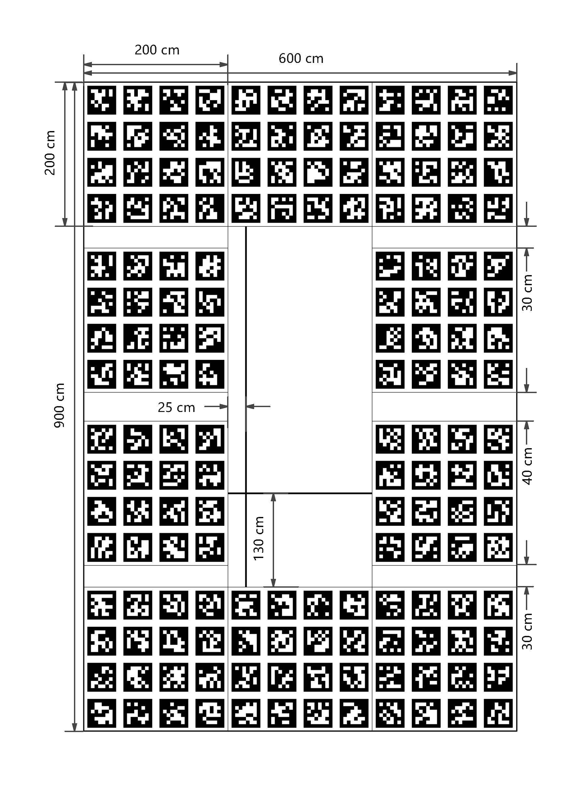

# 1.环境配置

- ubuntu (16.04)
- ROS kinetic
- OpenCV (2.4.9)
- Eigen3
- [apriltag_ros](https://github.com/AprilRobotics/apriltag_ros)

# 2.鱼眼相机内参标定

## 2.1 标定数据采集

在进行相机内参标定时，首先对四个鱼眼相机分别进行标定数据的采集。在进行数据采集时，应尽量使得标定板在各个维度进行相应的运动，在不离开视野区域的前提下，运动范围尽量遍布相机视野。

在标定图像采集完成后，在`./opencv_calibration`目录下建立`img_${camera}`文件夹存放采集好的标定图像，并生成`img_${camera}.txt`文件，列出所有标定图像的相对路径。以右视相机为例，标定图像存放在`./img_right`目录下，其对应的`./img_right.txt`文件内容为：

```
# ./img_right.txt
img_right/1631690408.524919.png
img_right/1631690409.663292.png
img_right/1631690410.457858.png
img_right/1631690411.546102.png
img_right/1631690412.438392.png
...	
```

## 2.2 相机内参标定

按上述方法完成标定图像布署后，在`./opencv_calibration`运行`run.sh`即可完成四个环视相机的内参标定。

```shell
cd ./opencv_calibration
./run.sh
```

# 3.相机-车体外参标定

## 3.1 标定数据采集

在进行相机-车体外参标定时，将车停放在标定布中心空白区域，车的左后轮停于十字交点处，左前轮和右后轮分别位于十字竖线和横线上。根据所选用的AprilTag码以及标定布尺寸，录入AprilTag配置文件`./src/apriltag_ros/apriltag_ros/config/tags.yaml `。



当车体位于标定布上正确位置后，便可以进行外参标定图像的采集。将采集好的标定图像放置于工程数据目录(`./data`)下，四个相机对应的目录组织方式与内参标定中相同。接着，生成文件`img.txt`，列出所有的标定图像文件名。

```
# ./data/img.txt
img1.jpg
img2.jpg
img3.jpg
...
```

## 3.2 相机-车体外参标定

按上述方式组织好采集的标定图像后，运行`image_to_msg`节点，发布标定图像，发布话题为`/cv_camera_${camera}/image_raw`以及`/cv_camera_${camera}/camera_info`。

```shell
rosrun image_to_msg image_to_msg
```

接着，运行`continuous_detection`节点，完成AprilTag的检测以及Tag码在相机坐标系下的位姿估计。

```shell
roslaunch apriltag_ros continuous_detection.launch 
```

在确保AprilTag正常检测后，运行`localize`节点，得到外参标定结果，即四个环视相机相对于地面标定布十字交点(即车体右后轮中心)的位置和姿态，并保存为`calib_extrinsic.yaml`文件。

```yaml
rosrun localize localize
```


